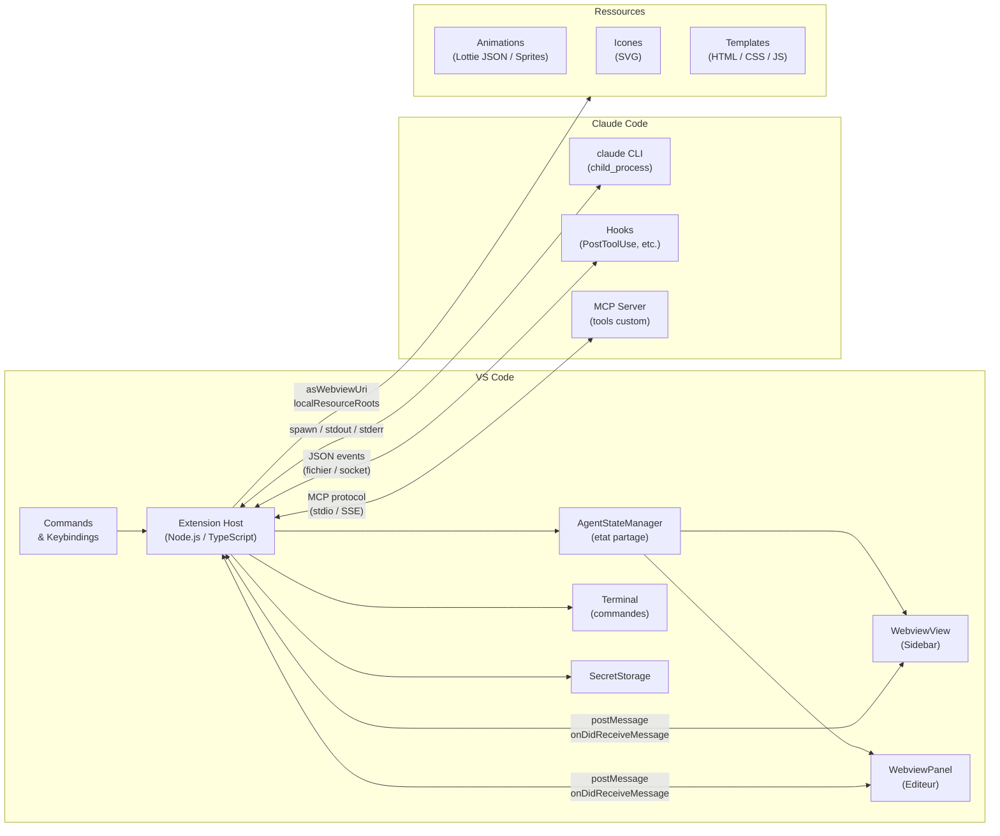
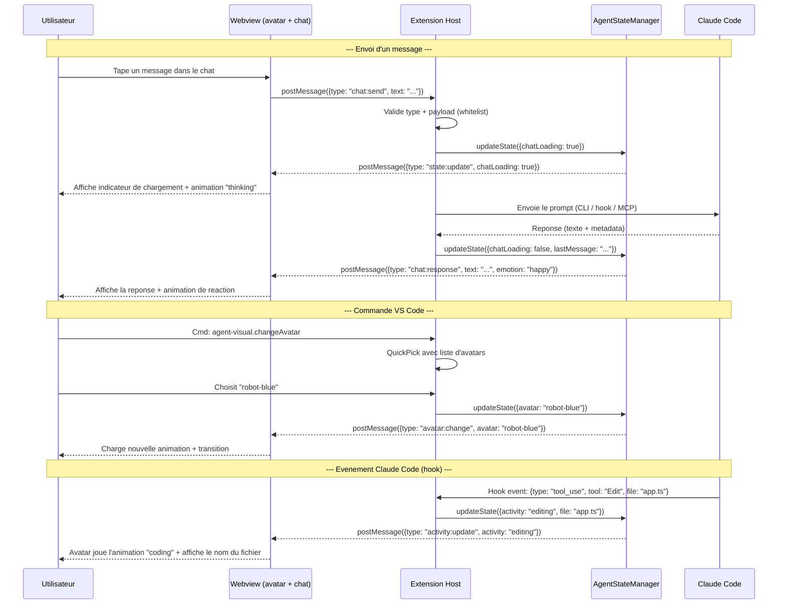

# Architecture Options — VS Code Agent Visual

## Table des matieres

1. [Tableau comparatif des solutions](#tableau-comparatif)
2. [Diagramme d'architecture](#diagramme-architecture)
3. [Flux de messages](#flux-de-messages)
4. [Timeline d'implementation](#timeline)
5. [Choix du framework d'animation](#framework-animation)
6. [Choix du mode d'integration Claude Code](#integration-claude-code)

---

## Tableau comparatif

| Solution | Complexite | Dependances | Avantages | Inconvenients |
|----------|-----------|-------------|-----------|---------------|
| **WebviewView (Sidebar)** | Moyenne | VS Code views + webview provider; Canvas/Lottie | Experience "assistant" naturelle, ancree a un conteneur de vues; deplacable entre Sidebar/Panel; toujours accessible | Espace parfois etroit; contraintes CSP/perf; webview = process Chromium |
| **WebviewPanel (onglet editeur)** | Faible-Moyenne | WebviewPanel API; Canvas/Lottie | Grand espace; ideal pour avatar + timeline + stage; iteration rapide | Consomme de la place dans l'editeur; moins "toujours visible" |
| **Double surface synchronisee** | Elevee | Les deux patterns + protocole d'etat partage | Mini-avatar en sidebar + grand mode en onglet; UX tres riche | Complexite d'etat (synchro); risques perf/memoire |
| **Terminal classique + commandes** | Faible | Commandes VS Code; terminal integre | Robuste, simple, zero webview; piloter l'agent en texte | Pas d'avatar anime; interaction textuelle uniquement |
| **Pseudo-terminal (Pseudoterminal API)** | Moyenne-Elevee | API Pseudoterminal + escape codes ANSI | Integration forte au Terminal; "animation" ASCII possible | Visuels limites; pas ideal pour de vrais avatars |
| **CLI spawn (`claude -p`)** | Moyenne | Node child_process + Claude Code CLI | Decouple l'UI; controle direct; fallback simple; cross-platform | Gestion I/O + permissions; dependance au CLI |
| **Hooks/Plugins Claude Code** | Elevee | Claude Code hooks + canal d'evenements | Evenementiel et reactif; peut publier des events (edit, test) pour animer | Setup plus long; bus d'evenements a outiller |
| **MCP Server custom** | Elevee | MCP SDK + serveur Node/Python | Bidirectionnel riche; outils custom; standard officiel | Complexite d'implementation; overhead reseau |
| **Extension existante (VS Code Pets)** | Faible | Extension tierce | Gain de temps; UX validee; reference d'animation | Personnalisation limitee; pas d'integration IA native |
| **Extension Peon Pet** | Faible-Moyenne | Extension tierce + hooks | Approche proche (avatar reactif aux agents); mentionne Claude Code | Tres recent; peu installe; dependance tiers |

## Diagramme d'architecture



### Explication

- **Extension Host** : process Node.js qui gere la logique metier, les commandes, et le bridge
- **AgentStateManager** : singleton qui maintient l'etat (avatar actif, conversation, config) et notifie les webviews
- **WebviewView** : iframe dans la sidebar — affiche le mini-avatar + chat
- **WebviewPanel** : iframe dans un onglet editeur — mode etendu
- **Terminal** : pour les commandes textuelles et le feedback status
- **SecretStorage** : stockage securise des tokens/cles API
- **Claude Code** : 3 modes d'integration possibles (CLI le plus simple, MCP le plus riche)
- **Assets** : fichiers servis aux webviews via `asWebviewUri`

## Flux de messages



## Timeline d'implementation

```mermaid
timeline
  title Plan d'implementation — VS Code Agent Visual
  section Phase 1 — Cadrage (1-2 jours)
    Choix surfaces UI : Sidebar et/ou Panel et/ou Editeur
    Choix integration Claude Code : CLI (defaut) vs hooks vs MCP
    Choix framework animation : Lottie (defaut) vs Canvas vs CSS
    Setup environnement : Node 18+ / TypeScript / yo code
  section Phase 2 — Prototype (3-5 jours)
    Scaffolding extension : yo code + structure projet
    WebviewView sidebar : Provider + HTML + animation basique
    Message passing : postMessage bidirectionnel
    Commandes VS Code : start / stop / pause
  section Phase 3 — Integration Claude Code (3-5 jours)
    Bridge CLI : spawn claude / parser stdout
    Chat fonctionnel : prompt -> reponse dans la webview
    Hooks (optionnel) : reagir aux evenements Claude Code
    MCP (optionnel) : outils custom bidirectionnels
  section Phase 4 — Durcissement (2-3 jours)
    CSP stricte : nonce + localResourceRoots + validation
    SecretStorage : migration des tokens
    Workspace Trust : Restricted Mode
    Performance : FPS cap / dispose / memoire
  section Phase 5 — Polish (2-3 jours)
    Accessibilite : ARIA / clavier / reduce-motion
    Multi-surfaces : synchro sidebar <-> panel
    WebviewPanel editeur : mode etendu
    Debug webview : Developer Tools
  section Phase 6 — Release (1-2 jours)
    Tests extension host : @vscode/test-cli
    Packaging : vsce package
    Documentation : README + CHANGELOG
    Publication : VS Code Marketplace (optionnel)
```



## Choix du framework d'animation {#framework-animation}

| Framework | Taille | Qualite | Interactivite | Ideal pour |
|-----------|--------|---------|---------------|------------|
| **lottie-web** | ~250 KB | Excellent (vectoriel) | Bonne (play/pause/segments) | Animations After Effects, idle loops, reactions |
| **Canvas 2D natif** | 0 KB | Bonne (pixel) | Totale (code custom) | Spritesheets, pixel art, controle total |
| **CSS animations** | 0 KB | Limitee | Faible | Rebonds, fades, transitions simples |
| **pixi.js** | ~400 KB | Excellent (WebGL) | Totale | Sprites complexes, particules, multi-objets |
| **three.js** | ~600 KB | Excellent (3D) | Totale | Modeles 3D, scenes complexes (attention perf) |
| **SVG anime (GSAP/anime.js)** | ~20-50 KB | Bonne | Bonne | Illustrations vectorielles animees |

**Recommandation par defaut** : `lottie-web` — le meilleur rapport qualite/taille/facilite.
Les animations se creent dans After Effects ou LottieFiles, s'exportent en JSON, et
lottie-web les joue avec controle programmatique (play, pause, goToAndStop, segments).

**Alternative budget zero** : Canvas 2D natif — aucune dependance, controle total,
mais necessite d'ecrire le moteur de rendu soi-meme (spritesheet + requestAnimationFrame).

## Choix du mode d'integration Claude Code {#integration-claude-code}

### Variante A — CLI (`claude -p`)

**Quand** : prototype, prompts one-shot, pas besoin de reactivite temps reel.

```
Extension --spawn--> claude -p "prompt" --output-format json
                     |
                     +--> stdout (reponse JSON)
                     +--> stderr (logs/erreurs)
```

- Cross-platform (Windows/Mac/Linux)
- Pas de dependance reseau supplementaire
- Limitation : pas d'evenements en temps reel

### Variante B — Hooks/Plugins

**Quand** : l'avatar doit reagir aux actions de Claude Code (edits, tests, commandes).

```
Claude Code --hook--> PostToolUse --> fichier JSON / socket --> Extension
                      PreToolUse
                      Notification
```

- Reactif : l'avatar s'anime quand Claude Code agit
- Necessite de configurer les hooks dans `settings.json` ou `.claude/settings.json`
- Plus complexe a setup mais plus riche

### Variante C — MCP Server

**Quand** : echanges bidirectionnels, outils custom, architecture a long terme.

```
Extension <--MCP protocol--> MCP Server (Node/Python)
                             |
                             +--> tools: get_avatar_state, send_chat, notify_activity
                             +--> resources: animation configs, agent profiles
```

- Le plus puissant et extensible
- Standard officiel Anthropic
- Overhead d'implementation significatif
- Ideal si tu veux exposer des outils a Claude Code (pas seulement consommer)

### Recommandation

**Commencer par A (CLI)**, valider le concept, puis evoluer vers B (hooks) pour la reactivite,
et C (MCP) uniquement si tu as besoin d'outils bidirectionnels.
