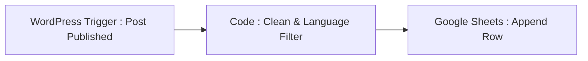

# Guide d'Automatisation : Synchronisation du Blog schoolsWP

Ce guide documente le fonctionnement de la synchronisation automatique de vos articles de blog vers le **Wiki local** et les **Google Sheets de référence** pour les trois langues supportées (Français, Allemand et Anglais).

---

## 📊 Références des Données

*   **Français (FR)** :
    *   **Wiki Local** : [articles-blog.md](file:///d:/VS%20Code/CLAUDE%20CODE/projects/schoolswp/content/docs/articles-blog.md)
    *   **Google Sheet Connecté** : [Index Articles Blog schoolsWP (FR)](https://docs.google.com/spreadsheets/d/1AXUQlvhFbbCrCex_LZjyh8kVS7KX2jn_TJGaDgtoSwU/edit) (ID: `1AXUQlvhFbbCrCex_LZjyh8kVS7KX2jn_TJGaDgtoSwU`)
*   **Allemand (DE)** :
    *   **Wiki Local** : [articles-blog-de.md](file:///d:/VS%20Code/CLAUDE%20CODE/projects/schoolswp/content/docs/articles-blog-de.md)
    *   **Google Sheet Connecté** : [Index Articles Blog schoolsWP (DE)](https://docs.google.com/spreadsheets/d/1-kp7VkCs_e5u17mAWEOjXtgbADAStl3qdJ45Am4Mqy0/edit) (ID: `1-kp7VkCs_e5u17mAWEOjXtgbADAStl3qdJ45Am4Mqy0`)
*   **Anglais (EN)** :
    *   **Wiki Local** : [articles-blog-en.md](file:///d:/VS%20Code/CLAUDE%20CODE/projects/schoolswp/content/docs/articles-blog-en.md)
    *   **Google Sheet Connecté** : [Index Articles Blog schoolsWP (EN)](https://docs.google.com/spreadsheets/d/1mFfPvThhJikma6KrN7edqs5A3ve2mqb1zqYCD54U_vc/edit) (ID: `1mFfPvThhJikma6KrN7edqs5A3ve2mqb1zqYCD54U_vc`)

---

## ⚡ Méthode 1 : Synchronisation Semi-Automatique (Locale & Agents)

Un script Python ultra-léger et autonome à la racine de votre projet gère l'ensemble : **`sync-blog.py`**.

### Comment ça marche ?
1. Le script interroge l'API REST publique de WordPress de schoolsWP (`/wp-json/wp/v2/posts?per_page=30`) pour récupérer les 30 derniers articles publiés.
2. Il détecte automatiquement la langue de chaque article (`fr`, `de`, `en`) à partir de l'URL du permalien (fourni par Polylang).
3. Il compare les articles récupérés avec la liste locale présente dans les fichiers respectifs (`articles-blog.md`, `articles-blog-de.md`, `articles-blog-en.md`).
4. S'il détecte un nouvel article :
    * Il nettoie son titre des entités HTML (comme `&amp;`) et des tirets longs `-` (conformément à la **Règle 13 bis**).
    * Il l'insère de manière ordonnée (le plus récent en premier) au début du tableau de la bonne année, puis ré-indexe automatiquement toutes les lignes du tableau pour garantir une présentation parfaite.
    * Il appelle en arrière-plan le CLI `gws` (avec fallback sécurisé sur Node.js) pour insérer une nouvelle ligne dans le Google Sheet connecté correspondant à la langue.

### Comment le lancer ?
Depuis votre terminal dans le projet :
```bash
python sync-blog.py
```

> [!TIP]
> Vos agents IA (comme Claude Code) exécuteront ce script automatiquement à chaque début de session ou de rédaction pour s'assurer que vos indices de contenus locaux sont toujours synchronisés à 100 % avec la production.

---

## ☁️ Méthode 2 : Automatisation 100 % Cloud (via n8n)

Puisque schoolsWP dispose d'une instance **n8n** hébergée (`schoolswp-n8n.wp1.host`), le processus a été entièrement automatisé via trois workflows cloud dédiés. Chacun écoute les publications WordPress en temps réel, filtre par langue pour éviter les contaminations de feuilles, assainit les titres (Règle 13 bis) et insère la nouvelle ligne dans le tableur correspondant.

### 📥 Liens Directs des Workflows n8n

*   **Français (FR)** :
    *   **Workflow n8n** : [Sync Blog WordPress (FR)](https://schoolswp-n8n.wp1.host/workflow/mPWJTce80mIoU1vi) (ID: `mPWJTce80mIoU1vi`)
    *   **Tableur Google Sheet** : `1AXUQlvhFbbCrCex_LZjyh8kVS7KX2jn_TJGaDgtoSwU`
*   **Allemand (DE)** :
    *   **Workflow n8n** : [Sync Blog WordPress (DE)](https://schoolswp-n8n.wp1.host/workflow/MHiMzmXLbHcA5RjN) (ID: `MHiMzmXLbHcA5RjN`)
    *   **Tableur Google Sheet** : `1-kp7VkCs_e5u17mAWEOjXtgbADAStl3qdJ45Am4Mqy0`
*   **Anglais (EN)** :
    *   **Workflow n8n** : [Sync Blog WordPress (EN)](https://schoolswp-n8n.wp1.host/workflow/fCm2LezkSuBeAtPU) (ID: `fCm2LezkSuBeAtPU`)
    *   **Tableur Google Sheet** : `1mFfPvThhJikma6KrN7edqs5A3ve2mqb1zqYCD54U_vc`

---

### Architecture Interne du Workflow n8n

Chaque workflow est composé d'une chaîne logique optimisée :



1.  **Déclencheur (WordPress Trigger)** :
    *   Écoute l'événement `Post Published` (Statut: `publish`, Type: `post`).

2.  **Filtrage Linguistique et Assainissement (Code)** :
    *   Pour éviter les contaminations, un filtre JavaScript interne inspecte le permalien (`link`). Si le post ne correspond pas à la langue du workflow, l'exécution s'arrête immédiatement en retournant un tableau vide `[]`.
    *   Si la langue concorde, le titre est assaini (remplacement des entités HTML et des tirets interdits `-`/`–` par des tirets normaux ` - `) et formaté pour Google Sheets.

3.  **Insertion Google Sheets (Append Row)** :
    *   La ligne formatée est ajoutée automatiquement à l'onglet `Feuille 1` du tableur ciblé.

*(Dernière mise à jour : 24 mai 2026)*
