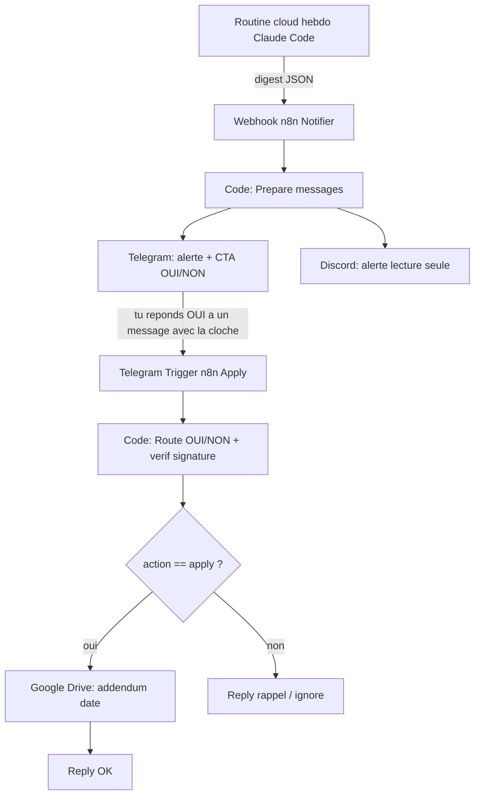

# SOP-03 : Veille active multi-source + alerte + validation Telegram OUI/NON (par plugin)

---

## Controle du Document & Changelog

- **Date de version** : 22 juin 2026
- **Version** : 1.3.0
- **Auteur** : schoolsWP team
- **Origine** : capitalisation de la session EasyCommerce du 2026-06-18. v1.1.0 : ajout de l'etape 1b (branding du bot - logo officiel + meta) lors de la session FluentCart du 2026-06-18. v1.2.0 : ajout de la section 11 (variante a l'echelle : 1 bot partage route par signature) apres avoir bute sur le plafond ~20 bots de BotFather, session du 2026-06-22. v1.3.0 : 2e passe du 2026-06-22 - renommage du bot partage en schoolsWP Plugin Radar, fusion SureDash + EasyCommerce (bots dedies supprimes), radar a 18 plugins, note securite tokens.

---

## 1. Objectif

Mettre un plugin WordPress tiers sous **veille active**, recevoir une alerte des qu'une source bouge, et pouvoir **valider d'un OUI/NON depuis Telegram** l'enrichissement du dossier Drive de connaissances du plugin.

Ce SOP est le complement de `SOP-veille-documentation-plugins.md` (SOP-02), qui couvre l'ingestion des tutoriels YouTube et une veille Discord du sitemap. Ici on ajoute :

1. une veille **multi-source** (WordPress.org API + YouTube RSS + sitemap) pilotee par une routine cloud Claude Code ;
2. un **fan-out** vers Telegram (canal d'action) et Discord (canal d'information) via n8n ;
3. une **validation humaine OUI/NON** depuis Telegram qui ecrit un addendum date dans le dossier Drive.

Convention : remplacer partout `<PLUGIN>` (libelle, ex EASYCOMMERCE), `<plugin>` (slug kebab, ex easycommerce), `<CHAT_ID>`, `<FOLDER_ID>`, `<WP_SLUG>`, `<YT_CHANNEL_ID>`.

---

## 2. Vue d'ensemble



Principe cle : **Telegram porte l'action**, Discord reste informatif (voir section 8 pour la raison technique).

---

## 3. Prerequis

- Dossier Drive de connaissances du plugin (note `<FOLDER_ID>`, typiquement le sous-dossier `02_knowledge-base`).
- Un credential Google Drive cote n8n (compte qui possede le dossier).
- Un compte Telegram et son `<CHAT_ID>`.
- Acces n8n (instance schoolsWP) et MCP n8n.
- Optionnel : credential webhook Discord pour le canal d'information.

---

## 4. Etape 1 - Creer un bot Telegram DEDIE

Regle : **un bot dedie par plugin important**. Ne jamais mutualiser un bot existant (Telegram n'autorise qu'un seul consommateur d'updates par bot ; deux Telegram Trigger sur le meme bot = conflit 409).

1. Dans Telegram, ouvrir `@BotFather` -> `/newbot` -> nom lisible -> username `@schoolswp_<plugin>_bot` -> recuperer le **token**.
2. Creer le credential n8n `telegramApi` "Telegram - schoolswp\_<plugin>\_bot" avec ce token. Ne jamais coller le token dans le chat : le faire saisir dans un fichier gitignore puis le supprimer une fois le credential cree.
3. **CRITIQUE** : l'utilisateur doit ouvrir le bot et appuyer sur **Start** (`/start`), sinon le bot ne peut pas ecrire ("Bad Request: chat not found").
4. Recuperer le `<CHAT_ID>` (via une 1ere execution, ou l'API `getUpdates`).

---

## 4 bis. Etape 1b - Brander le bot (logo officiel + meta)

Un bot de veille reste plus lisible avec l'identite visuelle du plugin surveille. A faire une fois, juste apres la creation du bot.

**Logo / avatar (botpic)** : il n'existe AUCUNE methode Bot API pour la photo de profil d'un bot ; ca passe obligatoirement par BotFather.

1. Recuperer le logo officiel carre du plugin. Source fiable : l'icone WordPress.org `https://ps.w.org/<WP_SLUG>/assets/icon.svg` (ou `icon-256x256.png?rev=...` quand un PNG existe ; certains plugins n'ont qu'un SVG).
2. Si seul un SVG existe, le rasteriser en PNG 512x512 -- fond plein (meme couleur que le logo) pour que le crop circulaire de Telegram reste net. Ex avec `tools/html-to-png/capture.mjs` : SVG dans un `.slide` de 512x512, puis `node tools/html-to-png/capture.mjs <dossier> --width=512 --height=512 --scale=1`.
3. Dans BotFather : `/setuserpic` -> choisir le bot -> envoyer le PNG. (Optionnel : `/setdescriptionpic` pour l'image au-dessus de la description en chat vide.)

**Textes (Name / About / Description / Commands)** : modifiables soit dans BotFather (`/setname`, `/setabouttext`, `/setdescription`, `/setcommands`), soit -- plus rapide et scriptable -- via la Bot API avec le token :

- About (max 120 car., affiche dans la fiche du bot) : `POST https://api.telegram.org/bot<token>/setMyShortDescription`, param `short_description`.
- Description (max 512 car., ecran de chat vide) : `setMyDescription`, param `description`.
- Commands : `setMyCommands`, param `commands` = JSON `[{"command":"start","description":"..."}]`. Pour un bot pilote par OUI/NON, garder `start` + `aide` suffit (le node Route renvoie deja un message d'aide par defaut).
- Nom : `setMyName`, param `name` (ATTENTION : fortement rate-limite, ne pas changer souvent ; laisser le nom pose a la creation si possible).

Astuce Windows / UTF-8 : passer les textes accentues via `curl --data-urlencode "champ@fichier.txt"` (fichier UTF-8), jamais en inline (les accents sont manges).

**Privacy Policy** : pas d'API ; dans BotFather `/setprivacypolicy` -> texte ou URL. Pour un bot interne, un texte court suffit ("usage interne schoolsWP, aucune donnee personnelle stockee, traite uniquement tes reponses OUI/NON pour archiver des notes de veille dans Drive").

Tonalite : ton schoolsWP (tutoiement, pas de hype). Nom explicite recommande : `schoolsWP Veille <PLUGIN>`.

---

## 5. Etape 2 - Workflow Notifier (fan-out Telegram + Discord)

Nom : `[Prod] Webhook > Discord+Telegram: <PLUGIN> Veille Notifier`.

Nodes :

1. **Webhook** (v2) : `POST`, path `<plugin>-veille-notifier`, `responseMode: responseNode`. Payload attendu `{discord, telegram, message?}`.
2. **Code "Prepare messages"** : normalise et ajoute le CTA Telegram + la note Discord lecture seule.
3. **Telegram sendMessage** : credential du bot dedie, `chatId = <CHAT_ID>`, texte `={{ $('Prepare messages').item.json.telegram }}`, `appendAttribution: false`.
4. **Discord sendLegacy** : `authentication: webhook`, credential Discord, `content = ={{ $('Prepare messages').item.json.discord }}`.
5. **Respond OK** (respondToWebhook) : `{ received: true }`.

Code du node "Prepare messages" :

```javascript
const b = $input.first().json.body || $input.first().json;
const fallback = b.message || "Veille <PLUGIN>: mise a jour detectee.";
const discord =
  b.discord && String(b.discord).trim() ? String(b.discord) : fallback;
const telegram =
  b.telegram && String(b.telegram).trim() ? String(b.telegram) : fallback;
const discordNote =
  "\n\n👉 Action a valider depuis Telegram : reponds OUI ou NON a l alerte la-bas. Ce message Discord est en lecture seule.";
const telegramNote =
  "\n\n👉 Reponds OUI a ce message pour mettre a jour le dossier Drive <PLUGIN>, NON pour ignorer.";
return [
  {
    json: { discord: discord + discordNote, telegram: telegram + telegramNote },
  },
];
```

Activer le workflow.

---

## 6. Etape 3 - Workflow Apply (OUI/NON -> Drive)

Nom : `[Prod] Telegram Trigger > Drive: <PLUGIN> Veille Apply (OUI/NON)`.

Nodes :

1. **Telegram Trigger** : credential du bot dedie, `updates: ["message"]`.
2. **Code "Route"** : detecte OUI/NON et exige la **signature du digest** (`🔔 VEILLE <PLUGIN>`) dans le message auquel on repond.
3. **IF "Is apply?"** : `{{ $json.action }} == "apply"`.
4. **Google Drive "Drive Create"** (v3) : `resource: file`, `operation: createFromText`, `folderId` (mode id) `<FOLDER_ID>`, `name = ={{ $json.fileName }}`, `content = ={{ $json.content }}`. `onError: continueRegularOutput`.
5. **Telegram "Reply OK"** : `text = =✅ Dossier <PLUGIN> mis a jour dans Drive.\nFichier : {{ $('Route').item.json.fileName }}`.
6. **Telegram "Reply other"** : `text = ={{ $('Route').item.json.replyText }}` (branche IF false).

Code du node "Route" :

```javascript
const item = $input.first();
const upd = item ? item.json : {};
const msg = upd.message || upd.edited_message || {};
const text = (msg.text || "").trim();
const repliedText = (msg.reply_to_message && msg.reply_to_message.text) || "";
const chatId = (msg.chat && msg.chat.id) || (msg.from && msg.from.id) || "";

const d = new Date();
const p = (n) => String(n).padStart(2, "0");
const dateStr =
  d.getFullYear() + "-" + p(d.getMonth() + 1) + "-" + p(d.getDate());

const isOui = /^(oui|o|yes|ok|y)\b/i.test(text) || text.toLowerCase() === "oui";
const isNon = /^(non|no|n)\b/i.test(text) || text.toLowerCase() === "non";
// La cloche est exigee : seul le vrai digest la porte (un rappel/confirmation ne l'a pas).
const isVeille = /🔔\s*VEILLE <PLUGIN>/i.test(repliedText);

let action = "reply";
let replyText = "";
let fileName = "";
let content = "";

if (isOui && isVeille) {
  action = "apply";
  fileName = "MAJ-" + dateStr + "-<plugin>-veille.md";
  content =
    "# MAJ <PLUGIN> (validee via Telegram) - " +
    dateStr +
    "\n\n" +
    "> Addendum cree automatiquement apres une reponse OUI a l alerte de veille hebdomadaire. " +
    "Source : le digest ci-dessous. A relire / affiner si besoin.\n\n" +
    "## Digest valide\n\n" +
    repliedText +
    "\n\n---\n" +
    "*Genere le " +
    dateStr +
    " via @schoolswp_<plugin>_bot.*\n";
} else if (isOui && !isVeille) {
  replyText =
    "Pour mettre a jour le dossier, reponds OUI en repondant DIRECTEMENT a l alerte hebdomadaire (le message qui commence par la cloche), pour que je sache quel digest enregistrer.";
} else if (isNon) {
  replyText = "OK, mise a jour ignoree. Le dossier Drive reste inchange.";
} else {
  replyText =
    "Bot de veille <PLUGIN>. Reponds OUI ou NON a une alerte hebdomadaire pour mettre a jour (ou non) le dossier Drive.";
}

return [{ json: { action, chatId, fileName, content, replyText } }];
```

Activer le workflow. Cote utilisateur : repondre OUI doit se faire avec la fonction **Repondre** de Telegram, en visant le message qui commence par `🔔 VEILLE <PLUGIN>`.

---

## 7. Etape 4 - Routine cloud de veille (Claude Code /schedule)

Creer une routine cloud (RemoteTrigger / `/schedule`) :

- **Cron** : hebdo, ex `0 7 * * 1` (lundi 09:00 Paris, UTC dans le cron).
- **Stateless** : pas de fichier d'etat, lookback par dates (ex 8 jours).
- **Sources a interroger** (curl/WebFetch, le sandbox cloud n'a pas les MCP DataForSEO/n8n) :
  - WordPress.org API : `https://api.wordpress.org/plugins/info/1.0/<WP_SLUG>.json` (version + changelog = signal le plus fiable).
  - YouTube RSS : `https://www.youtube.com/feeds/videos.xml?channel_id=<YT_CHANNEL_ID>` (detection stateless de nouvelles videos).
  - sitemap.xml (lastmod) du site editeur.
- **Sortie** : POST du digest sur le webhook notifier. Le texte du digest **DOIT commencer par** `🔔 VEILLE <PLUGIN>` (c'est la signature exigee par le garde-fou de l'apply).

---

## 8. Garde-fous et pieges (lecons de la session EasyCommerce)

- **Discord ne peut pas porter de boutons ici** : les interactions Discord exigent une verif de signature Ed25519, or le node Code de n8n (instance wp1.host) interdit le module crypto ("Module 'crypto' is disallowed", teste). Donc l'action reste 100% Telegram ; Discord est informatif. Alternatives lourdes ecartees : reactions + polling n8n, ou Cloudflare Worker externe.
- **Signature obligatoire** : exiger la cloche + libelle (`🔔 VEILLE <PLUGIN>`) avant toute ecriture Drive evite qu'un message de rappel ou de confirmation s'auto-valide.
- **/start obligatoire** : sans Start cote utilisateur, le bot renvoie "chat not found".
- **UTF-8 sous Windows** : pour tester via curl, ne pas passer le JSON en inline (les accents sont manges). Ecrire le payload dans un fichier UTF-8 (sans BOM) puis `curl --data-binary @fichier`. La routine cloud (Linux, JSON) est propre.
- **Ne pas casser la prod** : ne pas reutiliser un bot existant, ne pas toucher aux workflows de prod d'autres routines.
- **n8n draft/publish** : apres un patch, verifier la version publiee (`mode: active`) - c'est elle qui tourne.

---

## 9. Tests de validation

1. Envoyer un digest de test au webhook notifier (commencant par `🔔 VEILLE <PLUGIN>`), verifier l'execution du notifier (Telegram `ok:true`, Discord `success:true`).
2. Repondre OUI (fonction Repondre) au message Telegram, verifier l'execution de l'apply : Route `action: apply`, Drive Create cree le fichier, Reply OK confirme.
3. Verifier l'addendum dans le dossier Drive, puis **supprimer les fichiers de test** (un workflow n8n jetable avec un node Google Drive `deleteFile` fait l'affaire, a supprimer ensuite).

---

## 10. Checklist de parametres a remplir par plugin

| Parametre                       | Valeur                    |
| ------------------------------- | ------------------------- |
| `<PLUGIN>` (libelle majuscules) |                           |
| `<plugin>` (slug kebab)         |                           |
| Bot Telegram dedie              | `@schoolswp_<plugin>_bot` |
| Credential Telegram n8n         |                           |
| `<CHAT_ID>`                     |                           |
| `<FOLDER_ID>` Drive KB          |                           |
| Credential Drive n8n            |                           |
| `<WP_SLUG>` WordPress.org       |                           |
| `<YT_CHANNEL_ID>`               |                           |
| Sitemap URL                     |                           |
| ID routine cloud                |                           |
| ID workflow notifier            |                           |
| ID workflow apply               |                           |
| Branding bot (logo + meta) fait |                           |

---

## 11. Variante a l'echelle : 1 bot partage (route par signature)

Le modele "1 bot dedie par plugin" (sections 1 a 10) bute sur un plafond DUR : **BotFather n'autorise qu'environ 20 bots par compte** ("Sorry, you can't add more than 20 bots"). Au-dela de ~15 plugins surveilles, c'est ingerable. La parade : **un seul bot partage** pour toute la veille, qui route chaque validation OUI vers le bon dossier Drive grace a la signature `🔔 VEILLE <PLUGIN>` deja presente dans chaque digest.

Cette variante REMPLACE le "1 bot/plugin" pour le gros du parc. On peut garder un bot dedie pour 2-3 plugins phares (branding d'avatar par plugin) ; tout le reste passe par le bot partage.

**Pourquoi c'est techniquement valide** : la contrainte "un seul consommateur d'updates par bot" (sinon conflit 409) impose UN seul Telegram Trigger sur ce bot. C'est exactement le cas : un seul workflow Apply partage. Cote envoi, aucune limite : autant de plugins qu'on veut peuvent ecrire via le meme bot.

**Ce qui change par rapport au modele dedie :**

1. **Un seul bot, un seul credential, un seul Notifier, un seul Apply, une seule routine** (qui boucle sur la liste des plugins). Ajouter un plugin = 1 ligne dans la table de routage de l'Apply + 1 sous-dossier Drive + 1 ligne dans la liste de la routine. Plus jamais de nouveau bot.
2. **Webhook Notifier generique** : path `veille-notifier` (un seul). La routine POSTe un digest PAR plugin en mouvement.
3. **Apply : table de routage embarquee** dans le node Route. On extrait le libelle apres `🔔 VEILLE`, on le mappe vers `{folderId, slug}`, et le node Drive Create ecrit dans un `folderId` DYNAMIQUE (`={{ $json.folderId }}`).

Node Route (version partagee) - la map remplace le test `isVeille` du modele dedie :

```javascript
const PLUGINS = {
  FLUENTCRM: { folder: "<folderId>", slug: "fluentcrm" },
  "FLUENT BOARDS": { folder: "<folderId>", slug: "fluent-boards" },
  // ... une entree par plugin (cle = libelle apres la cloche, en MAJUSCULES)
};
let matchedKey = null;
const m = repliedText.match(/🔔\s*VEILLE\s+([^\n\r]+)/i);
if (m) {
  const after = m[1].toUpperCase();
  for (const key of Object.keys(PLUGINS)) {
    if (after.indexOf(key) === 0) {
      matchedKey = key;
      break;
    }
  }
}
// puis: if (isOui && matchedKey) -> action=apply, folderId=PLUGINS[matchedKey].folder, fileName base sur .slug
```

Regle sur les cles : aucune cle ne doit etre le prefixe d'une autre (sinon mauvais routage). Le digest de la routine DOIT commencer par exactement `🔔 VEILLE <CLE>`.

Routine cloud (version partagee) : meme principe que section 7, mais on fournit la **liste** `slug | SIGNATURE`, on boucle, on POSTe un digest par plugin dont `last_updated` est dans le lookback. Si rien ne bouge : un seul message recap (sans signature plugin, donc non archivable, c'est voulu).

**Implementation de reference (montee le 2026-06-22, 10 plugins) :**

| Brique                  | Valeur                                                                                                                                    |
| ----------------------- | ----------------------------------------------------------------------------------------------------------------------------------------- |
| Bot partage             | nom fonctionnel : **schoolsWP Plugin Radar** ; handle technique historique `@schoolswp_fluentcrm_bot` (NE JAMAIS supprimer = radar actif) |
| Credential Telegram n8n | `yKgWTTg2MKM8LTQi`                                                                                                                        |
| Notifier                | `Z7irewSMqGbIvUYd` (webhook `…/webhook/veille-notifier`)                                                                                  |
| Apply                   | `qCaJCzJNuAkVHiRP`                                                                                                                        |
| Routine cloud           | `trig_01X9xJ28SK3VBCXDVPjSjHzz` (`9 7 * * 1`)                                                                                             |
| Drive parent            | `Veille plugins schoolsWP` = `1oB6EjZH-BqT-Z66MjlkcT4-SszJ38jRQ`                                                                          |

Plugins de reference : FluentCRM, Fluent Boards, FluentBooking, Fluent Forms, Fluent Support, Tutor LMS, WP Social Ninja, Kadence, Rank Math, SecuPress (1 sous-dossier Drive chacun).

**MAJ 2026-06-22** : bot renomme **schoolsWP Plugin Radar** (ex-`@schoolswp_fluentcrm_bot` ; handle a passer en `@schoolswp_plugin_radar_bot` via BotFather `/setusername`, token inchange). Radar etendu a **18 plugins** : +SureDash +EasyCommerce (leurs veilles dediees fusionnees, workflows + routines DESACTIVES, dossiers Drive existants reutilises) +6 P1 (OttoKit/`suretriggers`, Ninja Tables, FluentSMTP, Polylang, FluentAffiliate, Presto Player). Methode de fusion = Option C (renommer le bot en place, zero migration). Detail complet : memoire `project_veille_plugins_partage_sop03_2026-06-22`.

**MAJ 2026-06-22 (etat reel apres suppressions)** : les bots Telegram dedies `@schoolswp_suredash_bot` et `@schoolswp_easycommerce_bot` ont ete SUPPRIMES dans BotFather (compte a 15/20). Le radar absorbe leur veille. Le handle `@schoolswp_fluentcrm_bot` est l'identifiant technique historique du radar : **ne JAMAIS le supprimer** (c'est le bot actif). Le passage du handle a `@schoolswp_plugin_radar_bot` (BotFather `/setusername`) est cosmetique, non bloquant, token inchange. Le nom fonctionnel a utiliser partout dans la doc = **schoolsWP Plugin Radar**.

**MAJ 2026-06-25** : FluentCart (WPManageNinja) ajoute au radar. (1) Routine hebdo `trig_01X9xJ28SK3VBCXDVPjSjHzz` : ligne `fluent-cart | FLUENTCART` ajoutee (19 plugins). (2) Nouvelle routine QUOTIDIENNE dediee doc + code : `trig_015t8pwVEJY3HbR4pVatLmXj` (`13 6 * * *`, ~08h13 Paris), sources = releases/commits GitHub `fluent-cart/fluent-cart` + changelog `docs.fluentcart.com/guide/changelog` (lookback 26h stateless ; WP.org non declencheur car deja couvert en hebdo) ; meme Notifier `Z7irewSMqGbIvUYd`, signature `🔔 VEILLE FLUENTCART` ; n'envoie rien si RAS (pas de message quotidien). (3) Sous-dossier Drive cree : `FluentCart` = `1TBsP3E76zukNzxcGhBfMr-sLwQ4-9C3l` (sous le parent radar `1oB6EjZH-BqT-Z66MjlkcT4-SszJ38jRQ`). Route Apply (FAIT 2026-06-25) : l'entree `'FLUENTCART': { folder: '1TBsP3E76zukNzxcGhBfMr-sLwQ4-9C3l', slug: 'fluent-cart' }` a ete ajoutee en tete de la map `PLUGINS` du node Route de l'Apply `qCaJCzJNuAkVHiRP` (19 entrees, workflow toujours actif). Methode : API REST n8n directe (GET/PUT `/api/v1/workflows/{id}`) car le serveur `n8n-mcp` local etait en cold-start timeout et le distant `claude.ai n8n` n'exposait pas ce workflow. Archivage Drive sur reponse OUI operationnel. Backup : `C:/Users/conta/.claude/apply-backup-qCaJCzJNuAkVHiRP.json`. Detail : memoires `project_fluentcart_veille_doc_github_2026-06-25` + `reference_n8n_mcp_local_coldstart_rest_fallback`.

**Securite tokens** : ne jamais exposer un token Telegram en clair dans un log, un rapport, un commit ou un export. Les tokens vivent uniquement dans les credentials n8n et l'env du VPS ; en cas de fuite, regenerer via BotFather `/revoke`.

### Prochaines ameliorations (radar, non engagees)

- **Bouton inline `✅ Archiver`** sous chaque alerte (callback Telegram) pour remplacer la reponse manuelle OUI/NON : un tap, zero ambiguite, et faisable sans crypto cote Telegram (contrairement a Discord).
- **BitSocial** : ameliorer / fusionner le canal de diffusion sortant (`@BitSocialSWP_bot`), hors radar (sortant vs entrant).
- **P2** : ajouter les plugins de priorite 2 apres une periode d'observation du parc actuel.
- **Veille premium** : changelog editeur hors WP.org pour les plugins strategiques uniquement.

---

## 12. Voir aussi

- `SOP-veille-documentation-plugins.md` (SOP-02) : ingestion YouTube + veille Discord sitemap.
- `SOP-schoolswp-novamira.md` : SOP maitre.
