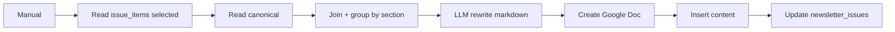

# Veille editoriale bihebdo — W101 + W102

## Vue d'ensemble

| # | Workflow | Trigger | Cadence |
|---|---|---|---|
| W101 | Ingestion multi-source → Sheets | Schedule + Gmail | 2h (RSS), 1h (Gmail) |
| W102 | Draft newsletter (Sheets → Google Docs) | Manual | J-1 bihebdo |

## Prerequis

**Credentials n8n** (a creer avant import) :
- `GoogleSheets_Prod_OAuth2` — OAuth2 Google Sheets
- `Gmail_Prod_OAuth2` — OAuth2 Gmail (scope read)
- `GoogleDocs_Prod_OAuth2` — OAuth2 Google Docs
- `Anthropic_Prod_Header` — Header Auth, name `x-api-key`, value = cle Anthropic

**Variables d'environnement n8n** :
- `VEILLE_SHEET_ID` — ID du Google Sheet bootstrap
- `VEILLE_DRAFTS_FOLDER_ID` — ID du dossier Drive pour les drafts
- `CURRENT_ISSUE_ID` — ex `ISSUE-2026-W16-M` (mis a jour manuellement avant chaque draft)

**Gmail** :
- Label `newsletter/plugins` cree
- Filtres entrants appliquent automatiquement ce label aux expediteurs fabricants
- Recuperer l'ID du label via Gmail API (`GET /users/me/labels`) et l'injecter dans le Gmail Trigger

## W101 — Flux

```mermaid
graph LR
  A[Schedule 2h] --> B[Read sources active]
  B --> C[Split sources]
  C --> D[RSS Fetch]
  D --> E[Attach source_id]
  E --> F[Normalize RSS]
  G[Gmail Trigger] --> H[Normalize email]
  F --> M[Merge]
  H --> M
  M --> N[Lookup hash]
  N --> O{IF new}
  O -- yes --> P[Build raw_id]
  P --> Q[Append raw_items]
  Q --> R[LLM Extract JSON]
  R --> S[Parse + score + cluster]
  S --> T[Lookup cluster]
  T --> U{IF cluster exists}
  U -- yes --> V[Update canonical confirmation]
  U -- no --> W[Append canonical new]
  V --> X[Append item_sources]
  W --> X
```

## W102 — Flux

## Ordre d'import

1. Deployer le Google Sheet via `tools/scripts/veille-sheets-bootstrap.gs` + `bootstrap()`
2. Creer les 4 credentials dans n8n
3. Definir les 3 variables d'environnement
4. Importer `W101.json` puis `W102.json` via UI n8n (Import from File)
5. Verifier que les credentials placeholders sont remplaces par les vrais IDs
6. Remplacer `PLACEHOLDER_LABEL_ID_newsletter_plugins` dans le Gmail Trigger par le label ID reel
7. Activer W101 en `[InDev]` pendant 48h, inspecter raw_items et canonical_items
8. Promouvoir `[InTesting]` apres validation qualite

## Checklist de validation

- [ ] Tous les UUID uniques (10 par workflow)
- [ ] typeVersions dans les limites (scheduleTrigger 1.2, googleSheets 4.5, httpRequest 4.2, code 2, set 3.4, if 2.2, merge 3.1, manualTrigger 1, rssFeedRead 1.1, gmailTrigger 1.2, splitInBatches 3, googleDocs 2)
- [ ] matchingColumns defini pour appendOrUpdate (cluster_key, issue_id)
- [ ] Pas de $helpers.httpRequest dans les Code nodes
- [ ] Credentials en placeholder (pas de clefs en dur)
- [ ] executionOrder v1
- [ ] Error workflow a configurer avant passage Prod (non inclus dans ce MVP)

## Points d'attention

- **Gmail API quotas** : polling 1h suffit, eviter < 15min
- **Anthropic tokens** : ~800 tokens output par item ingere, ~3000 pour le draft complet
- **Duplication RSS** : le `hash_raw = sha1(link + title)` protege, mais certains flux changent l'URL en gardant le titre → envisager un second hash sur le titre seul en v2
- **Gmail Trigger downloadAttachments** : laisser `false` pour economiser les quotas, on ne traite que le texte
- **Extraction LLM** : le prompt exige JSON strict ; si le modele retourne du texte narratif, le parse fallback sur `{}` et le score sera bas → item ira en rejected/backlog, pas de crash
- **Scraping HTTP** : pas inclus dans ce MVP (cf. SOP §10 Phase 3, ajout semaine 2)

## Evolutions v2

- Error Trigger workflow (W103) qui capture les echecs et ecrit dans `incidents`
- Sub-workflow `health_check` (W104) quotidien pour `sources.error_count_7d`
- Branche scraping HTTP (W105) pour 3-5 sources sans RSS
- Dedup semantique (embedding + similarite cosine) pour les quasi-doublons cross-marques
